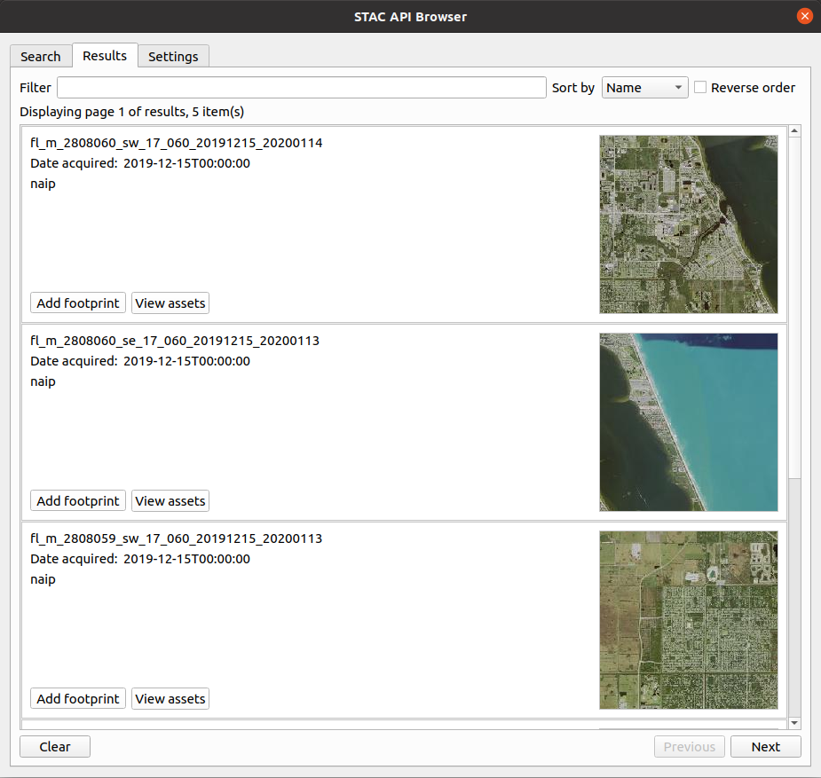

# QGIS STAC API Browser

STAC API Browser is a QGIS plugin that allows the exploration of geospatial data from providers that support
the STAC API specification
[https://github.com/radiantearth/stac-api-spec](https://github.com/radiantearth/stac-api-spec).

STAC API Browser provides a simple and user-friendly approach in searching and using STAC API resources in QGIS.
It offers a comfortable way to browse the STAC API items and ability to add the 
STAC API assets as map layers into the QGIS application.

The plugin was built through a joint effort between [Kartoza](https://kartoza.com/) and 
[Microsoft](https://planetarycomputer.microsoft.com/).

_Example search results, showing available items on a STAC API service_.

## Quick Installation
The plugin is available to download and install in QGIS from the official QGIS plugin repository 
[https://plugins.qgis.org/](https://plugins.qgis.org/).

To install the plugin, follow the below steps.

- Launch QGIS application and open plugin manager.
- Search for **STAC API Browser** in the **All** page of the manager.
- Click on the **STAC API Browser** result item and page with plugin information will show up.
- Click the **Install Plugin** button at the bottom of the dialog to install the plugin.

For more information about other ways to install the plugin, visit the [installation page](./installation).

## Source code
The source code is open source and available in a GitHub repository found here
[https://github.com/stac-utils/qgis-stac-plugin](https://github.com/stac-utils/qgis-stac-plugin).

## Help

- Any issue found when using the plugin or questions about the plugin
can be reported in the plugin GitHub repository issues page 
[https://github.com/stac-utils/qgis-stac-plugin/issues](https://github.com/stac-utils/qgis-stac-plugin/issues).
- Support is also available, contact us [info@kartoza.com](mailto:info@kartoza.com).

## License 

The plugin is published under the terms of the 
[GNU General Public License version 3](https://www.gnu.org/licenses/gpl-3.0.en.html).

